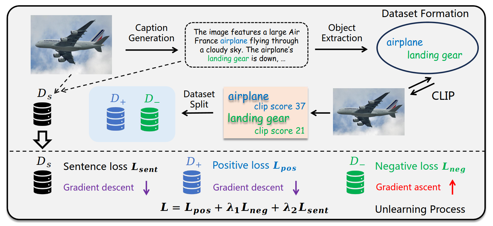

This repo is the official code for our work **EFUF: Efficient Fine-grained Unlearning Framework for Mitigating Hallucinations in Multimodal Large Language Models**.



We are still working on writing the docs of the code while waiting for our paper to be accepted.

If you find this helpful, please cite our preprint:

```
@misc{xing2024efuf,
      title={EFUF: Efficient Fine-grained Unlearning Framework for Mitigating Hallucinations in Multimodal Large Language Models},
      author={Shangyu Xing and Fei Zhao and Zhen Wu and Tuo An and Weihao Chen and Chunhui Li and Jianbing Zhang and Xinyu Dai},
      year={2024},
      eprint={2402.09801},
      archivePrefix={arXiv},
      primaryClass={cs.CL}
}
```
